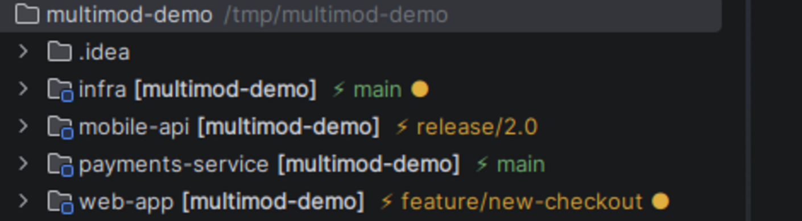

# Branch in Project View

IntelliJ IDEA plugin that shows the **current git branch** instead of the path
(the gray text / *location string*) next to each module / content root in the
**Project** tool window. In monorepos each module shows the branch of its own repo.



At a glance, per module: branch name, color (**green** on `main`/`master`, **orange**
otherwise) and an amber **●** when the working tree has uncommitted changes — here
`web-app` is on a feature branch with pending changes, `mobile-api` is still on
`release/2.0`, while `payments-service` is clean on `main`.

## How it works

- `BranchTreeStructureProvider` — a `TreeStructureProvider` that replaces the
  content-root nodes (the top-level "modules") with `BranchDirectoryNode`.
- `BranchDirectoryNode` — a `PsiDirectoryNode` subclass that overrides
  `updateImpl` to show, instead of the path:
  - a colored `⚡ <branch>`: **green** on `main`/`master`, **orange** on other branches;
  - `↑` (commits to push) / `↓` (commits to pull) arrows vs origin;
  - an **amber ●** if the repo's working tree has uncommitted changes.
  In detached HEAD it shows the short SHA.
- `ShowBranchesAction` + `BranchClickListener` — open the **native Git branch
  popup** (the same as "Git → Branches", with search) targeted at the module's
  repo, both from the context menu ("Git Branches…") and by **clicking the
  `⚡<branch>` text** on the node. The native popup (`GitBranchesTreePopupOnBackend`)
  is invoked via reflection because it is `internal` in Kotlin; falls back to a
  simple popup if unavailable.
- `BranchChangeRefreshListener` — forces a tree refresh on repo change, repo
  discovery (VCS mapping, async at startup) and incoming/outgoing info changes.

> Note: on IntelliJ 2026.x the classic `ProjectViewNodeDecorator` does **not**
> affect the rendering of Project view nodes (new architecture). That's why we act
> on the node itself via `TreeStructureProvider`, whose presentation is rendered.

## Build

Requires a JDK 21 (picked up by the toolchain) and uses the local IDE as the SDK
(`local("/home/andrea/work/idea-IU-262.5752.32")` in `build.gradle.kts`).

```bash
./gradlew buildPlugin
# artifact: build/distributions/branch-in-project-view-0.1.0.zip
```

## Installation

In IntelliJ: **Settings → Plugins → ⚙ → Install Plugin from Disk…** and select
the zip in `build/distributions/`. Then restart the IDE.

## Development / quick test

```bash
./gradlew runIde   # launches a sandbox IDE instance with the plugin installed
```

## License

Licensed under the [Apache License 2.0](LICENSE). Copyright 2026 Andrea Aresu.
